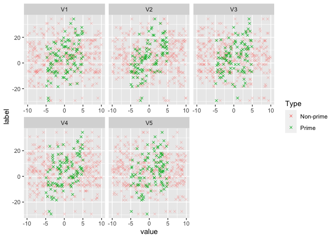
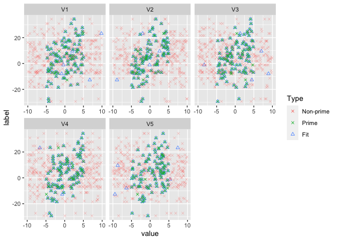

<!-- README.md is generated from README.Rmd. Please edit that file -->
<!-- To add a badge  -->
<!-- [](https://travis-ci.org/geanders/countyweather) -->
<!-- [](https://cran.r-project.org/package=countyweather) -->


Please visit the following website for more bioinformatics tools from Dr. Tao Wang's lab: <https://qbrc.swmed.edu/labs/wanglab>

This work is initiated when Dr. Seongoh Park visited QBRC at UT Southwestern Medical Center in 2018.

BayesianMIR
===========

This is a README file of the R package *BayesianMIR*. In our paper, we develop the Bayesian multiple instance regression model we call BMIR, applied to the multiple instance regression problem. For more details about the structure of data and the Bayesian modeling, we refer readers to our paper available [here](https://doi.org/10.1177/0962280220914321).

<!-- We assume the primary instance assumption used in @RayPage2005, that is, there is one primary instance explaining the bag-level response variable. -->
Installation of the package
---------------------------

To install our package, you may simply execute the following codes:

``` r
# install.packages("devtools")
devtools::install_github("inmybrain/BayesianMIR", subdir = "BayesianMIR") # don't forget to specify subdir!
```

If you come across a problem like [this](https://github.com/r-lib/remotes/issues/130), please refer to [this answer](https://github.com/r-lib/remotes/issues/130#issuecomment-423830669) in that issue.

<!-- Or you can install the source file using the command line after downloading it from [here](XXX) (NOT AVAILABLE NOW); -->
<!-- ```{bash, eval = FALSE} -->
<!-- R CMD INSTALL BayesianMIR_1.0.tar.gz -->
<!-- ``` -->
A basic example of using the package
------------------------------------

We give a toy example to apply the main function `BMIR_sampler`, which performs random sampling from the joint posterior distribution.

### Generate data

We first generate simulated data under the bag-instance structure.

``` r
rm(list = ls())

nsample <- 200
ninst <- 5
nprime <- 1 # do not change
nfeature <- 5

set.seed(6)
npoint <- (ninst - nprime) * nfeature
bag <- list()
for(i in 1:nsample){
  prime_inst <- matrix(runif(nfeature, -5, 5), ncol = nfeature)
  nonprime_inst <- (-1)^rbinom(npoint, 1, 1/2) * runif(npoint, min = -10, max = 10)
  nonprime_inst <- matrix(nonprime_inst, ncol = nfeature, byrow = F)
  
  # nonprime_inst <- matrix(c(rnorm(npoint, -5, 1),
  #                           rnorm(npoint, 5, 1)),
  #                         nrow = 2, byrow = T)
  # nonprime_inst <- nonprime_inst[cbind(sample(1:2, npoint, replace = T), 1:npoint)]
  # nonprime_inst <- matrix(nonprime_inst, ncol = nfeature, byrow = F)
  
  bag[[i]] <- as.data.frame(rbind(prime_inst, nonprime_inst))
}
beta_true <- rep(2, nfeature + 1)
label <- unlist(lapply(bag, function(feature){
  beta_true[1] + as.matrix(feature[1,,drop = FALSE]) %*% beta_true[-1]
}))
label <- label + rnorm(nsample, mean = 0, sd = 1)
```

### Exploratory data analysis

To facilitate our analysis, we use `Tidy_dataset` function to tidy data up. The first 100 samples are used for model estimation, and the others will be test samples to validate the fitted model.

``` r
library(BayesianMIR)
#> Warning: replacing previous import 'ggplot2::margin' by
#> 'randomForest::margin' when loading 'BayesianMIR'
tidydata <- Tidy_dataset(label = label[1:100],
                         feature_inst = bag[1:100])
newtidydata <- Tidy_dataset(feature_inst = bag[-(1:100)])
```

Applying `MISummarize` to the output of `Tidy_dataset`, we can get the basic information about the dataset:

-   the number of bags,
-   the number of features,
-   (summary of) the numbers of instances in bags (or bag sizes).

``` r
MISummarize(tidydata)
#> Number of bags : 100
#> Number of features : 5 (V1, V2, V3, V4, V5)
#> Number of instances in bags : 
#>    Min. 1st Qu.  Median    Mean 3rd Qu.    Max. 
#>       5       5       5       5       5       5
```

A scatter plot for multiple instances is given below using `MIScatterPlot`. Each dimension of covariates is plotted on the x-axis along with bag-level responses (labels) on the y-axis. If you know which instance(s) is(are) primary in each bag, then they would be distinguished from non-primary instances.

``` r
MIScatterPlot(tidydata = tidydata, 
              bag_size = 5,
              true_primary = lapply(1:tidydata$nsample, function(x) rep(c(T,F), c(1, ninst - 1)))
)
```



### Generate the Monte Carlo Markov Chains (model estimation)

We can obtain the MCMC samples using `BMIR_sampler`. By default, the first halves are discarded as the burn-in steps. You can thin the samples by using `nthin` option and get multiple chains by using `nchain` option. Please refer to the help page of the function to see what it returns.

``` r
## BMIR model fitting
ntotal <- 20000
BMIR_fit <- BMIR_sampler(ntotal = ntotal, tidydata = tidydata)
#> =============================================================
#> Multiple Instance Bayesian Regression
#> Elapsed time for chain1=0.061 mins: MCMC sampling is done!
```

### Visualization after model fitting

Using the fitted model, you can specify the estimated status of being a primary instance on the scatter plot provided by `MIScatterPlot`. You can check how many overlaps are between the estimated and the truth.

``` r
MIScatterPlot(tidydata = tidydata, 
              bag_size = 5,
              true_primary = lapply(1:tidydata$nsample, function(x) rep(c(T,F), c(1, ninst - 1))), 
              pred_primary = lapply(split(BMIR_fit$pip[,1], tidydata$membership), function(x) rank(-x, ties.method = "min") <= 1)
)
```



By slightly modifying `ggs_density` function from the package `ggmcmc`, we can show one of the Bayesian inferences that BMIR does provide: the highest posterior density intervals of parameters.

``` r
# install.packages("ggmcmc")
library("ggmcmc")
ggs_density <- function (D, ncol, family = NA, rug = FALSE, hpd = FALSE, greek = FALSE) 
  ## - ncol is added!
  ## - ci -> ggmcmc::ci
  ## - [Low, High] interval is commented
{
  if (!is.na(family)) {
    D <- get_family(D, family = family)
  }
  if (attributes(D)$nChains <= 1) {
    f <- ggplot(D, aes(x = value))
  }
  else {
    f <- ggplot(D, aes(x = value, colour = as.factor(Chain), 
                       fill = as.factor(Chain)))
  }
  f <- f + geom_density(alpha = 0.3) + scale_fill_discrete(name = "Chain") + 
    scale_colour_discrete(name = "Chain")
  if (!greek) {
    f <- f + facet_wrap(~Parameter, ncol = ncol, scales = "free")
  }
  else {
    f <- f + facet_wrap(~Parameter, ncol = ncol, scales = "free", 
                        labeller = label_parsed)
  }
  if (rug) 
    f <- f + geom_rug(alpha = 0.1)
  if (hpd) {
    ciD <- ggmcmc::ci(D)
    f <- f + geom_segment(data = ciD, size = 2, color = "blue", inherit.aes = FALSE, 
                          aes(x = low, xend = high, y = 0, yend = 0)) 
    # +geom_segment(
    #   data = ciD,
    #   size = 1,
    #   inherit.aes = FALSE,
    #   aes(
    #     x = Low,
    #     xend = High,
    #     y = 0,
    #     yend = 0
    #   )
    # )
  }
  return(f)
}
ggs_mcmc <- ggmcmc::ggs(BMIR_fit$mcmclist)
ggs_mcmc$Parameter <- factor(ggs_mcmc$Parameter, labels = c(paste0("coef", 1:(nfeature + 1)), "sig2_error"))
ggs_density(ggs_mcmc %>% 
              filter(Iteration > max(Iteration) / 2), 
            ncol = 2,
            hpd = TRUE) + 
  geom_vline(data = data.frame(Parameter = c(paste0("coef", 1:(nfeature + 1)), "sig2_error"),
                               true_val = c(rep(2, 1 + nfeature), 1)),
             aes(xintercept = true_val), color = "red") +
  labs(x = "Value", y = "Density") + 
  theme(axis.text.y = element_blank(),
        axis.ticks.y = element_blank())
```


### Prediction in new bags

When new bags are given, BMIR can both predict labels and identify primary instances using `predict.BMIR`. By default, `predict.BMIR` depends on `randomForest` function from the package `randomForest`, which helps identifying primary instances in new bags. If you specify `k` (the number of primary instances in each new bag) larger than 1, then the selected primary instances will be aggregated by their average.

``` r
pred_fit <- predict.BMIR(BMIRchain = BMIR_fit$mcmclist$Chain1, 
                         pip = BMIR_fit$pip[,1], 
                         tidydata = tidydata, 
                         newtidydata = newtidydata,
                         k = 1)
```

Let us see how prediction works.

``` r
ggplot(data = data.frame(pred = pred_fit$newtidydata$label, 
                         true = label[-(1:100)]), 
       mapping = aes(x = pred, y = true)) + 
  geom_point() + geom_abline(intercept = 0, slope = 1, color = "red")
```


Notes
-----

<!-- - For available covariance structures, see the help page; -->
<!-- ```{r, eval = FALSE} -->
<!-- ?Mclust_SEP_cpp -->
<!-- ``` -->
<!-- - As for initial assignment of cluster membership, each sample is assigned randomly to clusters. -->
Issues
------

We are happy to troubleshoot any issue with the package;

-   please contact to the maintainer by <seongohpark6@gmail.com>, or

-   please open an issue in the github repository.

<!-- ## Error and warning messages you may get -->
<!-- ## References  -->
